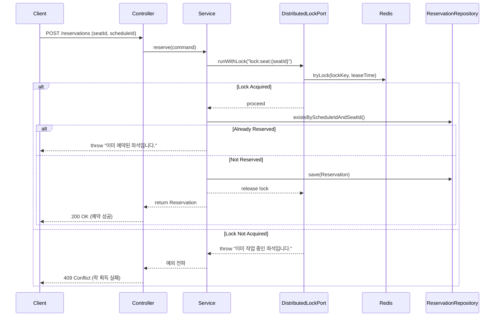

## ✅ `tryLock`의 내부 동작 요약 (Redisson 기준)

### 1. **락 획득 (`tryLock`)**
```kotlin
val locked = redissonClient.getLock("lock:seat:1234")
val success = locked.tryLock(0, 3, TimeUnit.SECONDS)
```

### 내부적으로 하는 일:
- Redis에 다음과 같은 형태로 데이터를 **SETNX(SET if Not eXists)** 명령으로 저장합니다:
  ```
  SET lock:seat:1234 UUID --NX --PX 3000
  ```
    - `NX`: 존재하지 않을 때만 설정
    - `PX 3000`: 3초 동안만 유지

- 성공 시: 락 획득 (`true` 반환)
- 실패 시: 이미 누군가가 락을 가지고 있음 (`false` 반환)

---

### 2. **락 해제 (`unlock`)**
```kotlin
locked.unlock()
```

### 내부적으로 하는 일:
- 락을 해제할 때는 Redis에서 **해당 키를 삭제**합니다.
- 단, 락을 획득한 클라이언트(스레드)가 **자신이 설정한 값과 일치할 경우에만 삭제**합니다.
    - 이 과정은 Lua Script로 원자적으로 처리됩니다:
      ```lua
      if redis.call("get", KEYS[1]) == ARGV[1] then
          return redis.call("del", KEYS[1])
      else
          return 0
      end
      ```

---

## ✅ 정리하자면

| 단계 | Redis에 어떤 작업? | 설명 |
|------|--------------------|------|
| `tryLock()` | `SET NX PX` | 락 시도: 없으면 등록하고 유효기간 부여 |
| 작업 수행 | - | 락을 가진 상태로 중요한 작업 수행 |
| `unlock()` | `DEL` (Lua로 안전하게) | 락 해제: 자신이 걸었던 락일 때만 삭제 |

---

## ✅ Redisson 락의 구조
Redisson은 내부적으로 **reentrant**, **watchdog**, **fair lock** 같은 다양한 락 옵션도 제공합니다:

- 기본 `lock()`은 30초마다 자동 갱신 (watchdog)
- `tryLock()`은 timeout을 넘기면 자동 해제 (이게 테스트에 더 적합)

---

## 영화 예약에서 분산 락의 사용

- FLOW

