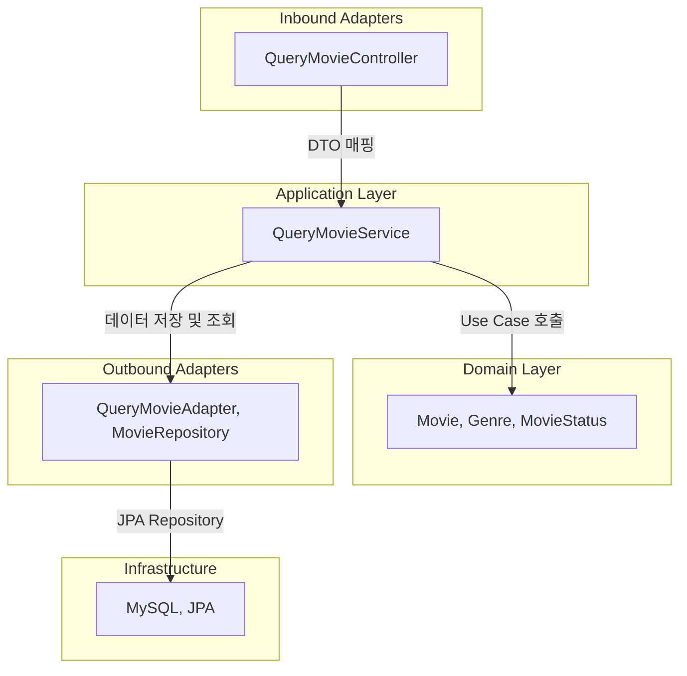

### `service-movie` 아키텍처 설명

`service-movie` 모듈은 영화 정보를 관리하는 서비스로, 헥사고날 아키텍처(Hexagonal Architecture)를 기반으로 설계되었다. 
이 아키텍처는 도메인 로직을 중심으로 어댑터(Adapters)와 포트(Ports)를 분리하였다.


- Controller에서 API 요청을 받고, Application Service가 비즈니스 로직을 수행.
- Domain이 핵심 로직을 담당하며, Persistence Adapter를 통해 데이터를 저장/조회.
- JPA Repository가 실제 데이터베이스(MySQL 등)와 통신.
---

### 1. **전체 구조**
```
service-movie
├── src
│   ├── main
│   │   ├── kotlin
│   │   │   └── yin
│   │   │       └── servicemovie
│   │   │           ├── ServiceMovieApplication.kt
│   │   │           ├── adapter
│   │   │           │   ├── in (Inbound Adapters)
│   │   │           │   │   ├── QueryMovieController.kt
│   │   │           │   │   └── dto
│   │   │           │   │       └── QueryMovieRequest.kt
│   │   │           │   └── out (Outbound Adapters)
│   │   │           │       └── persistence
│   │   │           │           ├── MovieCustom.kt
│   │   │           │           ├── MovieCustomImpl.kt
│   │   │           │           ├── MovieRepository.kt
│   │   │           │           ├── QueryMovieAdapter.kt
│   │   │           │           └── entity
│   │   │           │               ├── ImageEntity.kt
│   │   │           │               ├── MovieEntity.kt
│   │   │           │               ├── ScheduleEntity.kt
│   │   │           │               ├── SeatEntity.kt
│   │   │           │               └── TheaterEntity.kt
│   │   │           ├── application
│   │   │           │   ├── command
│   │   │           │   │   └── QueryMovieCommand.kt
│   │   │           │   ├── dto
│   │   │           │   │   ├── QueryMovieResponse.kt
│   │   │           │   │   └── QueryScheduleResponse.kt
│   │   │           │   └── service
│   │   │           │       └── QueryMovieService.kt
│   │   │           ├── domain
│   │   │           │   ├── Genre.kt
│   │   │           │   ├── Movie.kt
│   │   │           │   └── MovieStatus.kt
│   │   │           └── port
│   │   │               ├── in
│   │   │               │   └── QueryMovieUseCase.kt
│   │   │               └── out
│   │   │                   └── MovieRepositoryPort.kt
│   │   └── resources
│   │       └── application.yml
│   ├── test
│   │   └── kotlin
│   │       └── yin
│   │           └── servicemovie
│   │               └── ServiceMovieApplicationTests.kt
├── build.gradle.kts
└── application.yml
```
---

### 2. **아키텍처 구성 요소**

#### 2.1 **Application Entry Point**
- `ServiceMovieApplication.kt`
    - `@SpringBootApplication`이 붙어 있는 애플리케이션의 진입점.

---

#### 2.2 **Adapters (입출력 어댑터)**
##### ✅ `adapter/in`
- 외부에서 들어오는 요청을 처리하는 부분.
- `QueryMovieController.kt`: 영화 관련 조회 API 제공.
- `dto/QueryMovieRequest.kt`: 클라이언트에서 요청하는 데이터 구조.

##### ✅ `adapter/out`
- 외부 시스템과 연결하는 역할.
- `persistence/`: DB와의 상호작용 담당.
    - `MovieRepository.kt`: JPA를 통해 데이터베이스와 통신.
    - `QueryMovieAdapter.kt`: 영화 조회 관련 데이터를 제공하는 어댑터.
    - `entity/`: `MovieEntity`, `ImageEntity`, `ScheduleEntity` 등 DB 테이블과 매핑되는 JPA 엔티티.

---

#### 2.3 **Application Layer**
- 비즈니스 로직을 담당하며, 도메인과 어댑터 간의 중재 역할을 한다.
- `QueryMovieService.kt`: `QueryMovieUseCase`를 구현하여 영화 데이터를 조회.
- `command/QueryMovieCommand.kt`: 특정 영화 조회 요청을 처리하는 명령 객체.
- `dto/QueryMovieResponse.kt`: 영화 조회 응답 객체.

---

#### 2.4 **Domain Layer**
- 핵심 비즈니스 로직이 포함된 계층.
- `Movie.kt`, `Genre.kt`, `MovieStatus.kt` 등 영화와 관련된 비즈니스 개념을 정의.
- 순수한 도메인 모델이므로 외부 라이브러리(JPA 등)에 의존하지 않는다.

---

#### 2.5 **Ports (Use Case 정의)**
- 어댑터와 도메인을 분리하는 역할.
- `port/in/QueryMovieUseCase.kt`: 영화 조회 관련 Use Case 정의.
- `port/out/MovieRepositoryPort.kt`: DB와 상호작용하는 인터페이스.
