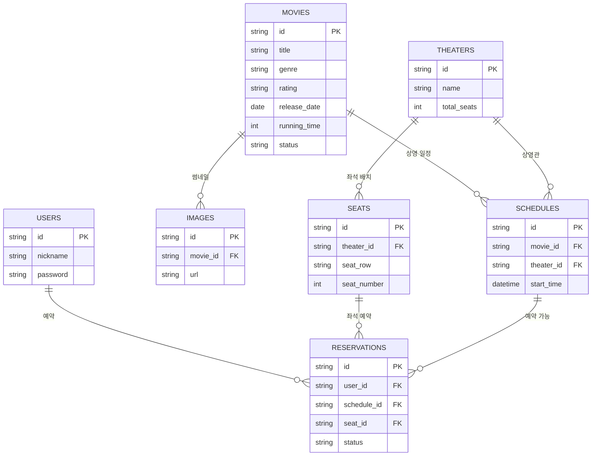

아래에서는 영화 예매 시스템의 데이터 모델을 설명하며, 본 설계는 핵심 엔터티만 포함하여 단순하고 확장 가능한 구조를 유지하는 것을 목표로 합니다.

## 주요 엔터티 설명
### 1. USERS (사용자)
- **id (PK):** 사용자 고유 식별자
- **nickname:** 사용자 닉네임
- **password:** 사용자 비밀번호 (해싱된 값 저장 필요)

### 2. MOVIES (영화)
- **id (PK):** 영화 고유 식별자
- **title:** 영화 제목
- **genre:** 장르
- **rating:** 연령 등급
- **release_date:** 개봉일
- **running_time:** 상영 시간 (분 단위)
- **status:** 현재 상영 상태 (예: "상영 중", "예정", "종영")

### 3. IMAGES (영화 이미지)
- **id (PK):** 이미지 고유 식별자
- **movie_id (FK):** 해당 이미지가 속한 영화
- **url:** 이미지 경로

### 4. THEATERS (극장)
- **id (PK):** 극장 고유 식별자
- **name:** 극장명
- **total_seats:** 극장 내 총 좌석 수 (데이터 정합성을 위해 동적 쿼리 사용 가능)

### 5. SEATS (좌석)
- **id (PK):** 좌석 고유 식별자
- **theater_id (FK):** 해당 좌석이 속한 극장
- **seat_row:** 좌석 행 번호
- **seat_number:** 좌석 번호

### 6. SCHEDULES (상영 일정)
- **id (PK):** 상영 일정 고유 식별자
- **movie_id (FK):** 해당 영화
- **theater_id (FK):** 상영 극장
- **start_time:** 상영 시작 시간

### 7. RESERVATIONS (예매)
- **id (PK):** 예매 고유 식별자
- **user_id (FK):** 예매한 사용자
- **schedule_id (FK):** 예매한 상영 일정
- **seat_id (FK):** 예매된 좌석
- **status:** 예매 상태 (예: "예약 완료", "취소됨")

## 관계 설명
1. **사용자(USERS) ↔ 예매(RESERVATIONS)** : 한 사용자는 여러 개의 예매를 할 수 있다. (1:N 관계)
2. **영화(MOVIES) ↔ 상영 일정(SCHEDULES)** : 한 영화는 여러 상영 일정을 가질 수 있다. (1:N 관계)
3. **극장(THEATERS) ↔ 상영 일정(SCHEDULES)** : 한 극장에서 여러 영화가 상영될 수 있다. (1:N 관계)
4. **극장(THEATERS) ↔ 좌석(SEATS)** : 한 극장은 여러 개의 좌석을 가질 수 있다. (1:N 관계)
5. **좌석(SEATS) ↔ 예매(RESERVATIONS)** : 특정 좌석은 하나의 예매만 가질 수 있다. (1:N 관계)
6. **상영 일정(SCHEDULES) ↔ 예매(RESERVATIONS)** : 하나의 상영 일정에서 여러 좌석이 예약될 수 있다. (1:N 관계)
7. **영화(MOVIES) ↔ 이미지(IMAGES)** : 한 영화는 여러 개의 이미지(포스터, 스틸컷 등)를 가질 수 있다. (1:N 관계)